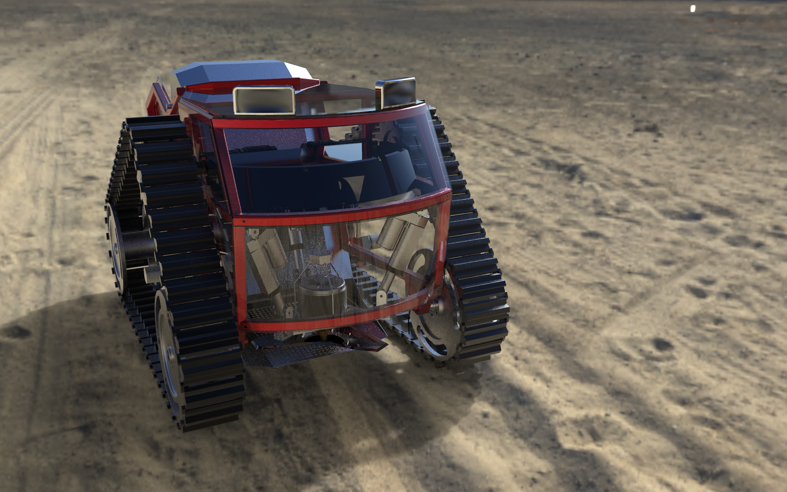
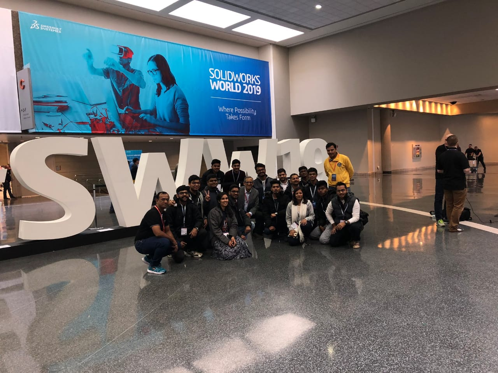

# AIRWUS 

## Autonomous Intra-Row Weed Removal System

In this project I and [Nishchay Sachdeva](https://www.linkedin.com/in/nishchay-sachdeva/) designed a low-cost Autonomous Weed Removal system for selected Indian agricultural fields. I developed a virtual CAD model, adhering to standard industrial DFM guidelines. Drafted a costing, simulation, analysis & design calculation report
with a detailed manufacturing Manual.

Participated (team of 2) in Dassault Systemes product design contest and ended-up Top 10 finalist out of 1120 Participants.
We were also selected for design presentation at Solidworks World 2019 Conference, Dallas, TX

## Problem Statement

Availability of unskilled labor, willing to work in the agricultural industry is decreasing day by-day. Nevertheless, demand for laborers in agriculture remains, as it was earlier. As a result, farmers must pay more for laborers. However, there are systems or machines been developed in India which perform a few of the agricultural tasks (harvester, thresher etc.), but many activities still require human interaction or are not automated. Weed (unwanted crops) cutting is one of the tasks done by laborers by hand pulling or by weed removal tool operated by the laborer. Automating the process of weed removal and collection in the agricultural sector will be beneficial for farmer directly or indirectly in a long term manner.

## Objective

A systematic design of an Autonomous Intra Row Weed Uprooting system is being provided as a solution to the problem addressed. The objective of system is to remove weeds and carry the same with it, equipped with some additional features that will help farmers in optimizing the process. The design aims to eliminate the need of unskilled labor for the task of weed removal, and perform the task autonomously, also the farmer can control the system remotely, by manual override.

## Detailed Manufacturing Manual

The Manufacturing Manual includes BOM, Raw materials, System  tree house & manufacturing details required to manufacture the system
<Button type="secondary" href="https://github.com/mihyr/mihr.io/raw/master/projects/airwus/src/content/DIY_Report.pdf">View Manufacturing Manual</Button>

## Design Calculations, Simulation & Sustainability Report

The Report contains FEA analysis results, cost break-down of the system in INR, Sustainability report for environmental impact (Calculated using CML impact assessment method. & various design calculations of the system.   
<Button type="secondary" href="https://github.com/mihyr/mihr.io/raw/master/projects/airwus/src/content/Design_Calculations_Simulation_Costing_Sustainability_Report.pdf">View Report</Button>

### Soldidworks World Conference 2019

> Author: [Mihir Patel](https://github.com/mihyr)