## Detailed Manufacturing Manual

The Manufacturing Manual includes BOM, Raw materials, System  tree house & manufacturing details required to manufacture the system
<Button type="secondary" href="https://github.com/mihyr/mihr.io/raw/master/projects/airwus/src/content/DIY_Report.pdf">View Manufacturing Manual</Button>

## Design Calculations, Simulation & Sustainability Report

The Report contains FEA analysis results, cost break-down of the system in INR, Sustainability report for environmental impact (Calculated using CML impact assessment method. & various design calculations of the system.   
<Button type="secondary" href="https://github.com/mihyr/mihr.io/raw/master/projects/airwus/src/content/Design_Calculations_Simulation_Costing_Sustainability_Report.pdf">View Report</Button>

----

## Report

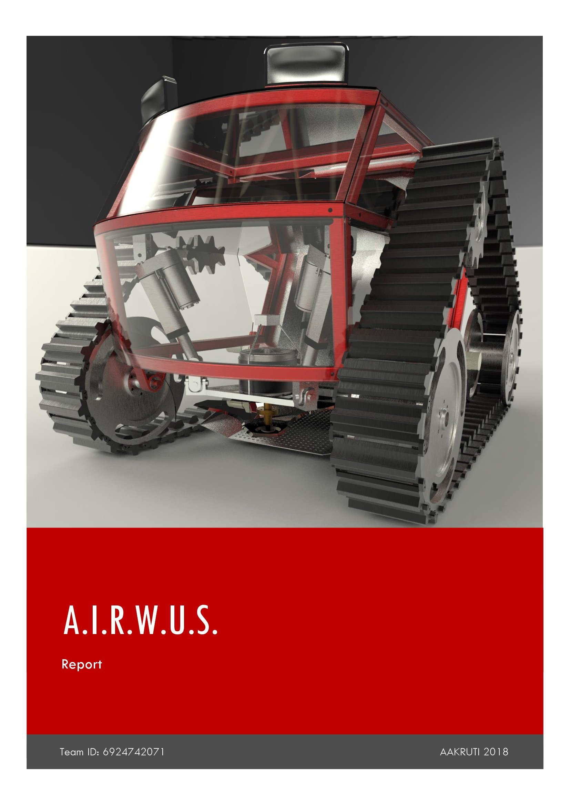
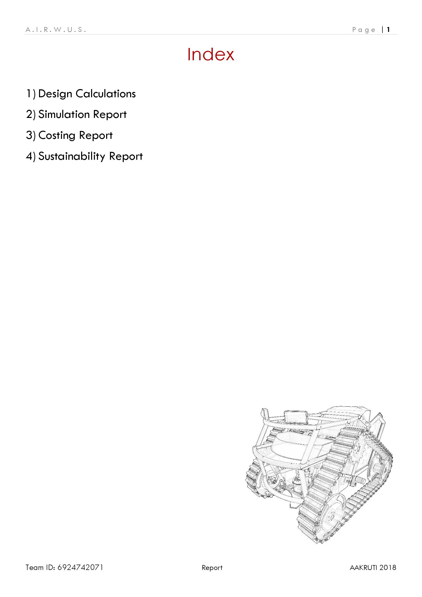
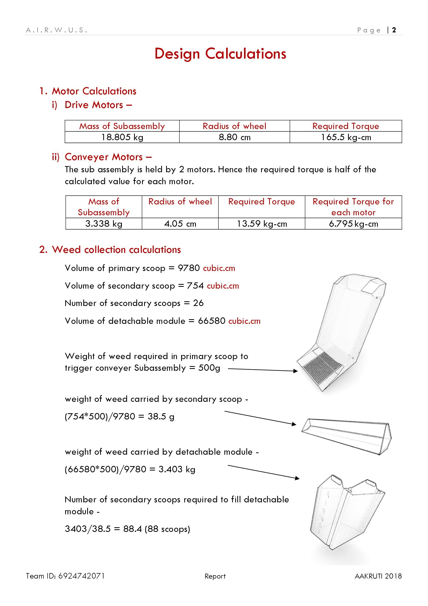
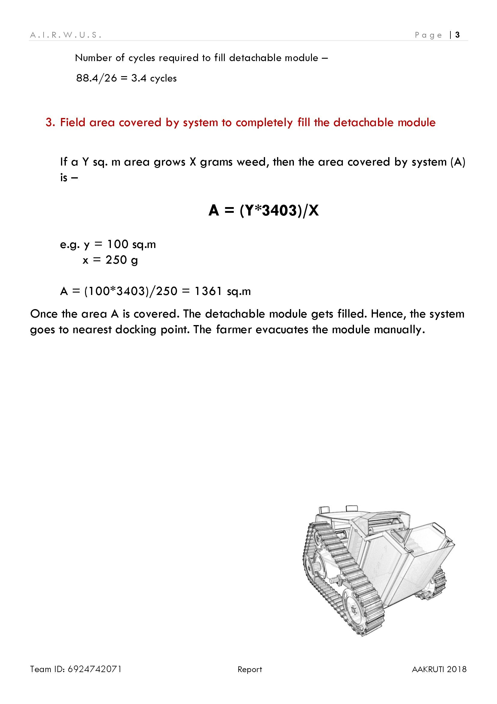
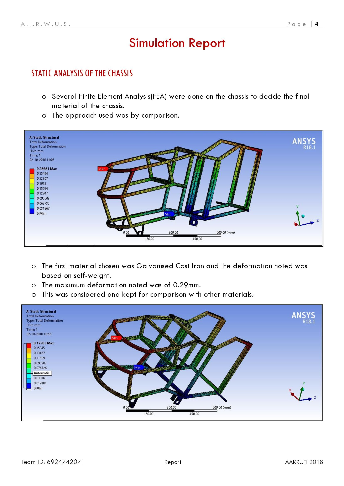
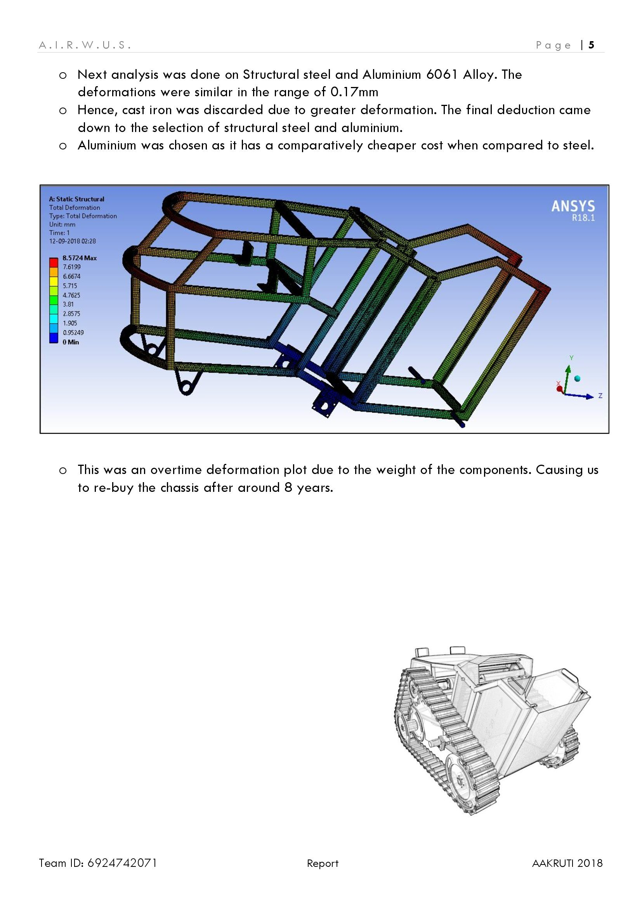
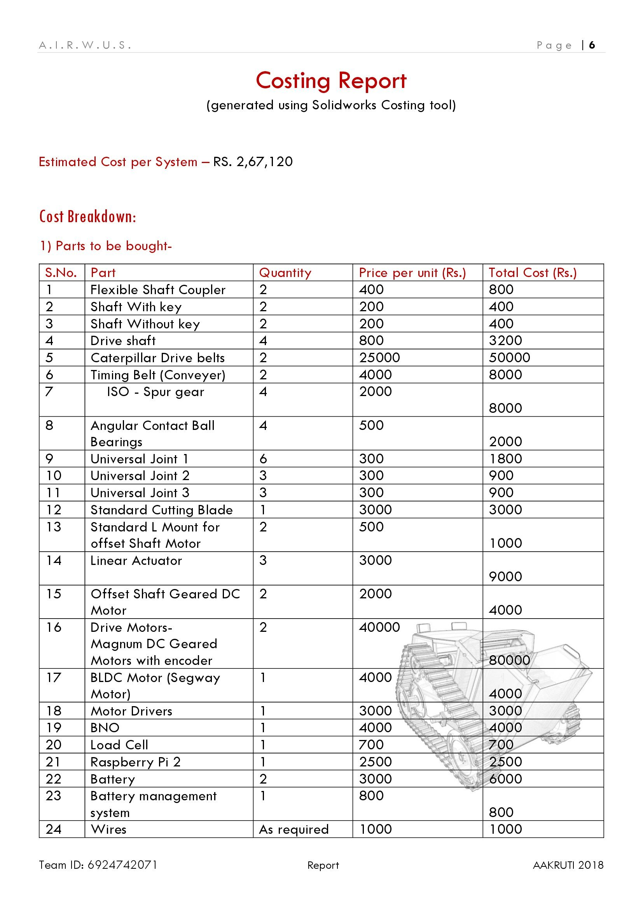
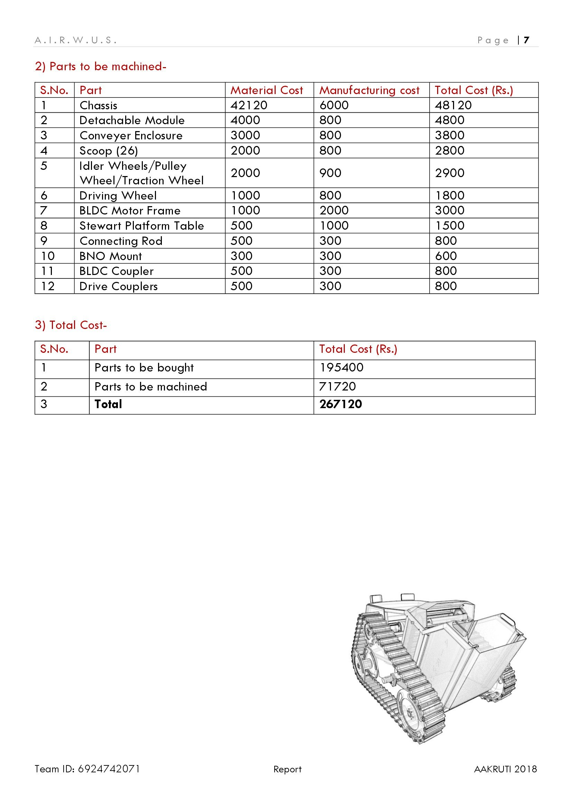
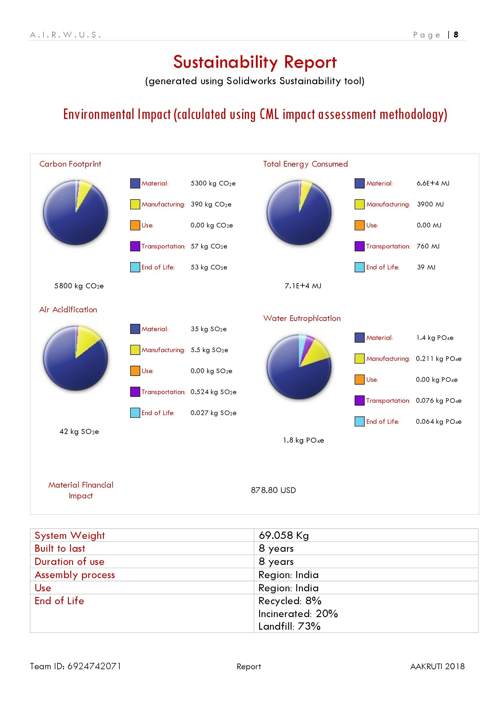
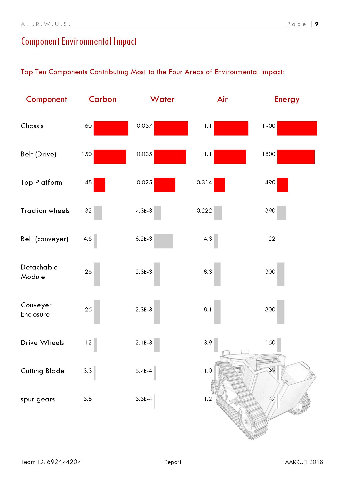
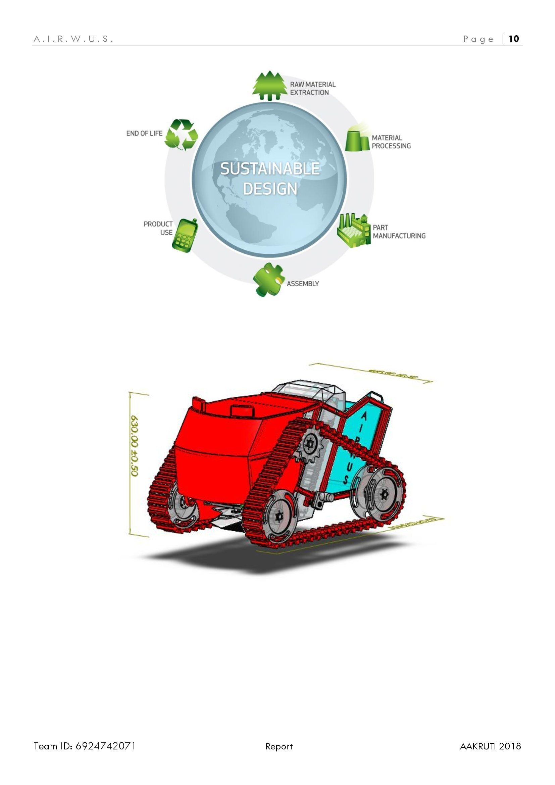
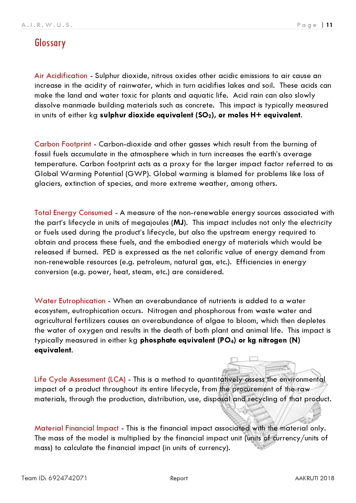

> Author: [Mihir Patel](https://github.com/mihyr)