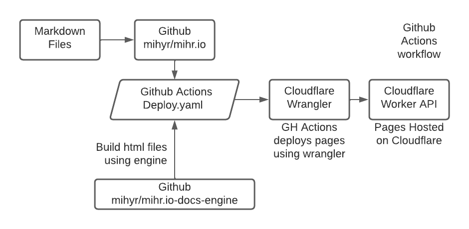

# How to automate Deployment using Github Actions

- Docs generation can be automated using Github actions and cloudflare wrangler cli tool.
- Image below shows the workflow.



## Workflow:

- Just add new markdown files to `projects` folder and commit to repo.
- Github actions will automatically create a ubuntu docker instance, use `mihr.io-docs-engine` to generate static html pages, and deploy to cloudflare workers using wrangler cli tool.

<Button type="secondary" href="https://github.com/mihyr/mihr.io/blob/master/.github/workflows/deploy.yml">Link to my setup</Button>

## Sample Actions workflow

```
name: Deploy Projects

on:
  push:
    branches:
      - master

jobs:
  deploy-pegasus:
    runs-on: ubuntu-latest
    name: pegasus
    defaults:
      run:
        shell: bash
        working-directory: projects/pegasus
    steps:
      - uses: actions/checkout@v2
      - uses: actions/setup-node@v1
        with:
          node-version: 14.2.0
      - run: |
          npm install
          npm run ghactionsbootstrap --force
          npm run build
      
      - name: Publish pegasus
        uses: cloudflare/wrangler-action@1.3.0
        with:
          apiToken: ${{ secrets.CF_API_TOKEN }}
          workingDirectory: "projects/pegasus"
        env:
          USER: root
          CF_ACCOUNT_ID: ${{ secrets.CF_ACCOUNT_ID }}
          CF_ZONE_ID: ${{ secrets.CF_ZONE_ID }}

  deploy-netbots:
    runs-on: ubuntu-latest
    name: Netbots
    defaults:
      run:
        shell: bash
        working-directory: projects/netbots
    steps:
      - uses: actions/checkout@v2
      - uses: actions/setup-node@v1
        with:
          node-version: 14.2.0
      - run: |
          npm install
          npm run ghactionsbootstrap --force
          npm run build
      
      - name: Publish Netbots
        uses: cloudflare/wrangler-action@1.3.0
        with:
          apiToken: ${{ secrets.CF_API_TOKEN }}
          workingDirectory: "projects/netbots"
        env:
          USER: root
          CF_ACCOUNT_ID: ${{ secrets.CF_ACCOUNT_ID }}
          CF_ZONE_ID: ${{ secrets.CF_ZONE_ID }}
```

> Author: [Mihir Patel](https://github.com/mihyr)